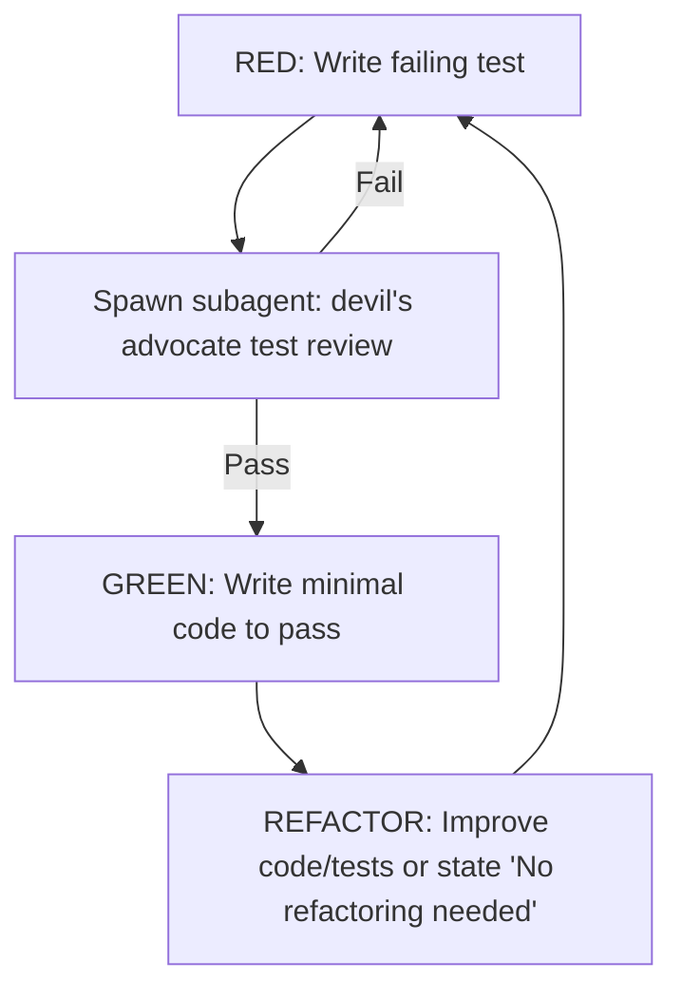

## Workflow

The devil's advocate subagent reviews test quality against the checklists below before implementation begins.

## Checklists

1. Follow the "Detroit School" of TDD (Classical TDD). Never mock internal methods or nearby collaborators.
2. Use `inline_snapshot` for complex object state verification instead of partial field assertions.
3. Prefer fewer, higher-value tests: One real integration test beats three mock-based unit tests.
4. Drop tests covered by type checker/linter
5. Parametrize `ValidationError` cases into one test.
6. Tests belong in their domain file, not a per-feature file. Visual effect snapshots go in `test_rendering.py`; use real image fixtures so differences are obvious to reviewers.
7. Snapshot tests subsume pixel-assertion behavioral tests — drop the latter when snapshots exist. Before adding a test, check existing coverage; only add if a genuinely new contract is introduced.
8. Extend an existing relevant test to cover a new concern rather than adding a new test — new tests are justified only when no existing test can naturally absorb the change.
