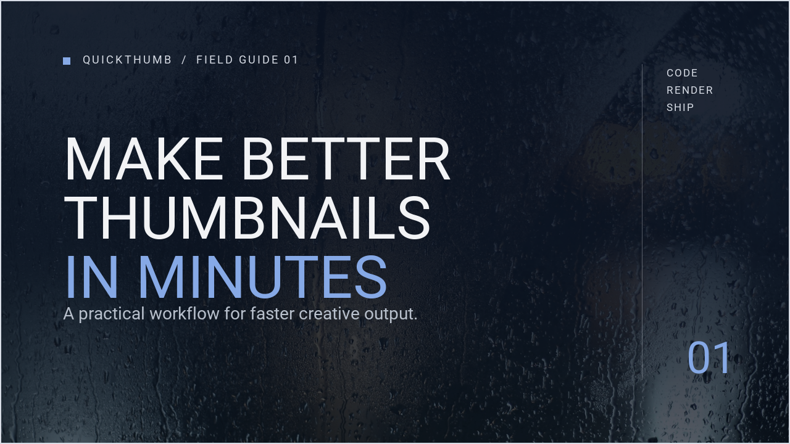
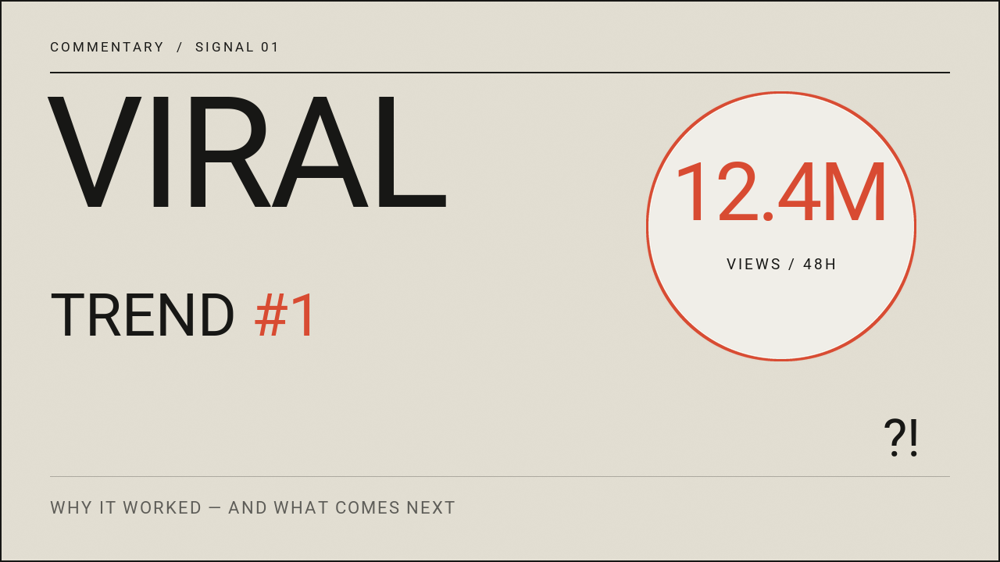
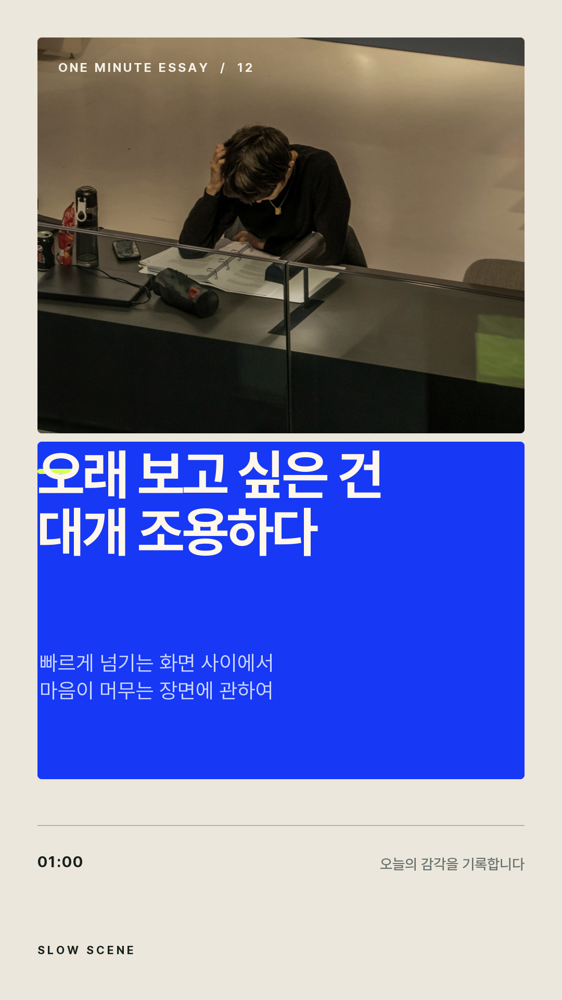
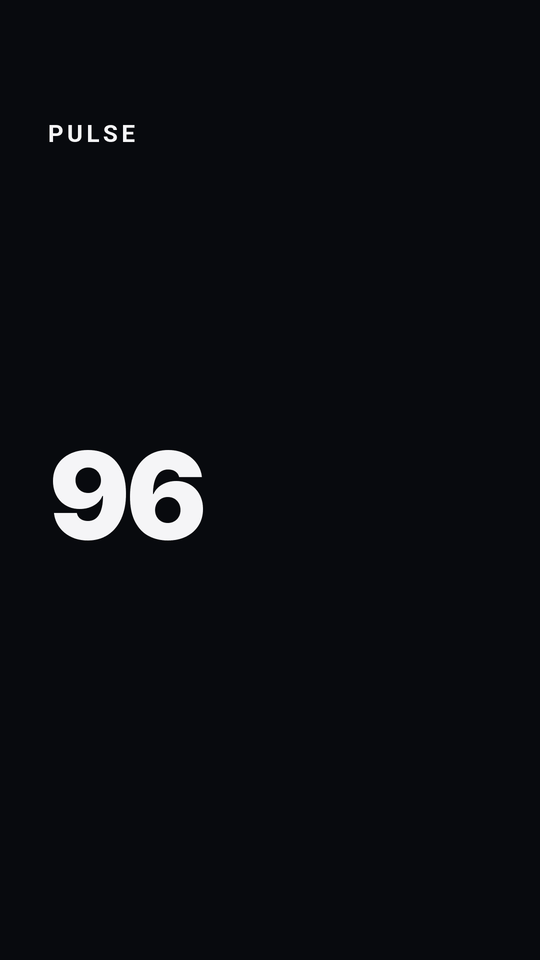

<p align="center">
  
</p>

<h1 align="center">quickthumb</h1>

<p align="center">
  <strong>Design thumbnails, social graphics, and presentation visuals in Python.</strong>
  <br />
  One layered API. Deterministic output. Ready for automation.
</p>

<p align="center">
  <a href="https://sjquant.github.io/quickthumb/getting-started/">Get started</a>
  ·
  <a href="https://sjquant.github.io/quickthumb/cookbook/">Browse recipes</a>
  ·
  <a href="https://sjquant.github.io/quickthumb/api/">API reference</a>
</p>


## Create the image. Keep the system

quickthumb turns a visual composition into reusable Python or JSON. Build it once,
change the content or assets, and render consistent creative at any scale.

```bash
pip install quickthumb
```

```python
from quickthumb import Canvas

canvas = (
    Canvas.from_aspect_ratio("16:9", base_width=1280)
    .background(color="#F5F5F7")
    .text(
        "Make the message impossible to miss.",
        size=88,
        color="#1D1D1F",
        weight=700,
        position=(80, 180),
        max_width=820,
    )
    .shape(
        "rectangle",
        position=(80, 500),
        width=180,
        height=8,
        color="#0066CC",
    )
)

canvas.render("announcement.png")
```

The core workflow stays small:

1. Create a `Canvas`.
2. Add backgrounds, text, images, shapes, SVG, or auto-layout groups.
3. Call `render()`.

[Follow the five-minute guide →](https://sjquant.github.io/quickthumb/getting-started/)

## Built for creative automation

- **Layered by default** — compose visuals in the same order people think about them.
- **Python or JSON** — author directly, generate specs with AI, or template content at scale.
- **One source, many formats** — render images, animated media, documents, and slide decks.
- **Designed to be checked** — diagnostics catch common layout and legibility problems before export.

## Gallery

| YouTube thumbnail | Commentary thumbnail | Tutorial cover |
| --- | --- | --- |
|  |  |  |

| Instagram news card | Podcast promo |
| --- | --- |
|  |  |

<table>
  <thead>
    <tr>
      <th>Vertical shorts cover</th>
      <th>Animated product reel</th>
    </tr>
  </thead>
  <tbody>
    <tr>
      <td align="center">
        
      </td>
      <td align="center">
        
      </td>
    </tr>
  </tbody>
</table>

[Explore the examples and source files →](examples/README.md)

## Render wherever the work goes

```python
canvas.render("creative.png")
canvas.render("creative.svg")
canvas.render("creative.html")
canvas.render("creative.pptx")
canvas.render("creative.pdf")
canvas.render("creative.gif")
canvas.render("creative.mp4")
```

Multi-slide `Deck` compositions can also render to numbered images, PDF, PPTX,
HTML slideshows, GIF, WebM, and narrated MP4.

Some formats use optional dependencies. See
[Installation](https://sjquant.github.io/quickthumb/installation/) and
[Exporting](https://sjquant.github.io/quickthumb/exports/) for the exact setup and format behavior.

## Pick a path

| I want to… | Start here |
| --- | --- |
| Make my first graphic | [Getting Started](https://sjquant.github.io/quickthumb/getting-started/) |
| Build a proven layout | [Cookbook](https://sjquant.github.io/quickthumb/cookbook/) |
| Generate visuals with JSON or AI | [JSON & AI Workflow](https://sjquant.github.io/quickthumb/json-schema/) |
| Build a multi-slide deck | [Deck guide](https://sjquant.github.io/quickthumb/api/deck/) |
| Validate a composition | [Diagnostics & CLI](https://sjquant.github.io/quickthumb/diagnostics/) |
| Look up a class or option | [API Reference](https://sjquant.github.io/quickthumb/api/) |

## License

[MIT](LICENSE)
