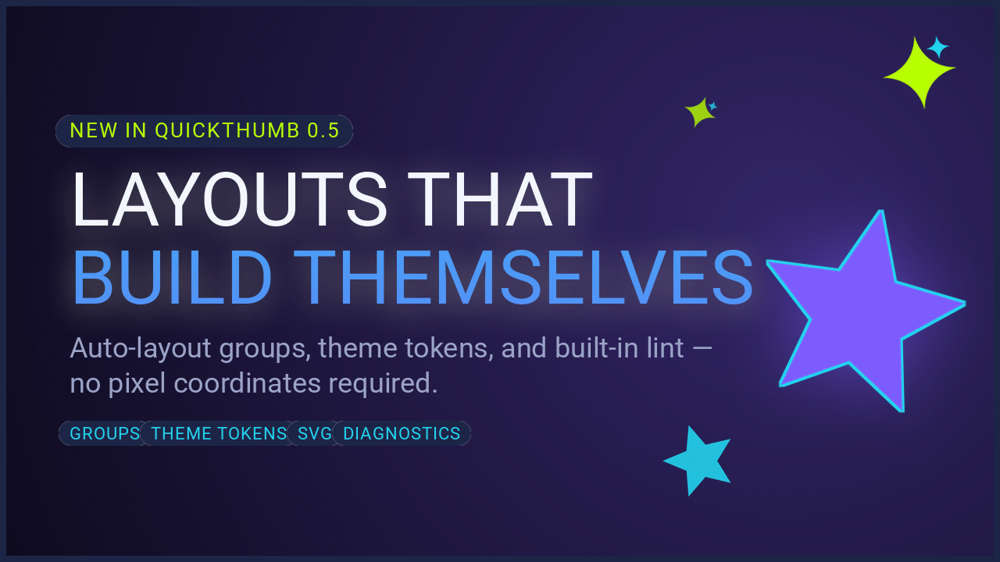
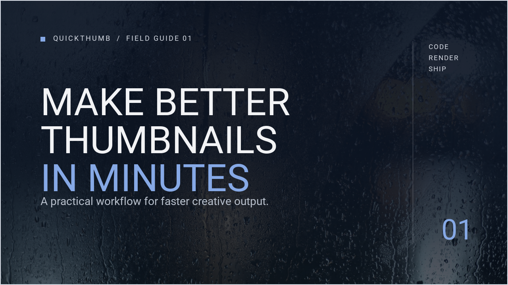
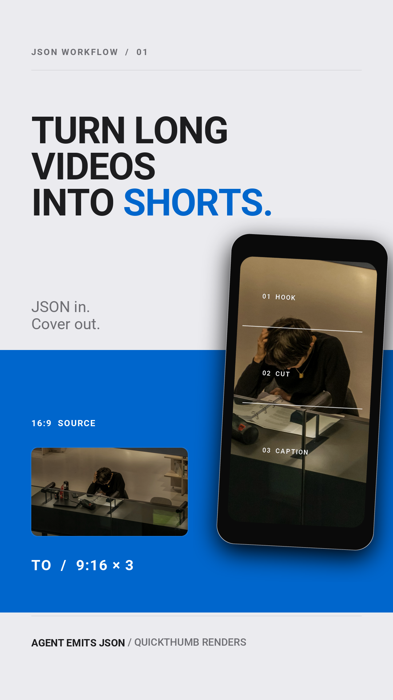
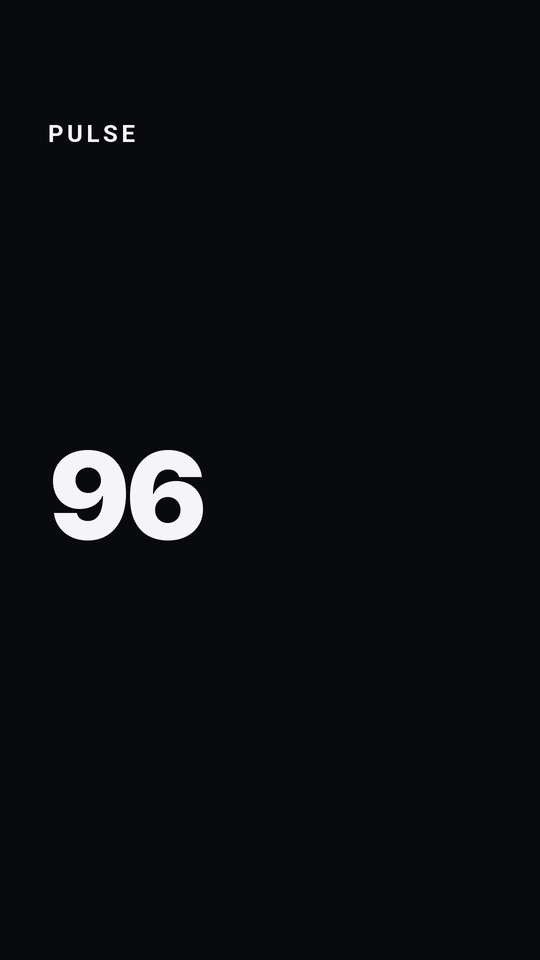

<p align="center">
  
</p>

<h1 align="center">quickthumb</h1>

<p align="center">
  <strong>Thumbnails, social images, and slides from Python or JSON.</strong>
  <br />
  Describe the image as layers. The same input gives the same pixels every time.
</p>

<p align="center">
  <a href="https://quickthumb.solaqua.dev/getting-started/">Get started</a>
  ·
  <a href="https://quickthumb.solaqua.dev/cookbook/">Browse recipes</a>
  ·
  <a href="https://quickthumb.solaqua.dev/api/">API reference</a>
</p>



## Quick start

Write a design once as code or JSON, then change the text, images, or colors and
render it again as many times as you need.

```bash
pip install quickthumb
```

```python
from quickthumb import Canvas

canvas = (
    Canvas.from_aspect_ratio("16:9", base_width=1280)
    .background(color="#F5F5F7")
    .text(
        "Make the message impossible to miss.",
        size=88,
        color="#1D1D1F",
        weight=700,
        position=(80, 180),
        max_width=820,
    )
    .shape(
        "rectangle",
        position=(80, 500),
        width=180,
        height=8,
        color="#0066CC",
    )
)

canvas.render("announcement.png")
```

The core workflow stays small:

1. Create a `Canvas`.
2. Add backgrounds, text, images, shapes, SVG, or auto-layout groups.
3. Call `render()`.

[Follow the five-minute guide →](https://quickthumb.solaqua.dev/getting-started/)

## What it does

- Layers are drawn in the order you add them, the same order you'd describe the image in.
- Every design can be written in Python or as a JSON spec, so a template or an LLM can produce it.
- One canvas exports to PNG, JPEG, WebP, SVG, HTML, PDF, PPTX, GIF, MP4, and WebM.
- `diagnose()` finds text that is too small, runs off the canvas, or has too little contrast, before you export.

## Gallery

| YouTube thumbnail | Commentary thumbnail | Tutorial cover |
| --- | --- | --- |
|  |  |  |

| Instagram news card | Podcast promo |
| --- | --- |
|  |  |

<table>
  <thead>
    <tr>
      <th>Vertical shorts cover</th>
      <th>Animated product reel</th>
    </tr>
  </thead>
  <tbody>
    <tr>
      <td align="center">
        
      </td>
      <td align="center">
        
      </td>
    </tr>
  </tbody>
</table>

[Explore the examples and source files →](examples/README.md)

## Output formats

```python
canvas.render("creative.png")
canvas.render("creative.svg")
canvas.render("creative.html")
canvas.render("creative.pptx")
canvas.render("creative.pdf")
canvas.render("creative.gif")
canvas.render("creative.mp4")
```

Multi-slide `Deck` compositions can also render to numbered images, PDF, PPTX,
HTML slideshows, GIF, WebM, and narrated MP4.

Some formats use optional dependencies. See
[Installation](https://quickthumb.solaqua.dev/installation/) and
[Exporting](https://quickthumb.solaqua.dev/exports/) for the exact setup and format behavior.

## Where to go next

| I want to… | Start here |
| --- | --- |
| Make my first graphic | [Getting Started](https://quickthumb.solaqua.dev/getting-started/) |
| Build a proven layout | [Cookbook](https://quickthumb.solaqua.dev/cookbook/) |
| Generate visuals with JSON or AI | [JSON & AI Workflow](https://quickthumb.solaqua.dev/json-schema/) |
| Build a multi-slide deck | [Deck guide](https://quickthumb.solaqua.dev/api/deck/) |
| Validate a composition | [Diagnostics & CLI](https://quickthumb.solaqua.dev/diagnostics/) |
| Look up a class or option | [API Reference](https://quickthumb.solaqua.dev/api/) |

## License

[MIT](LICENSE)
