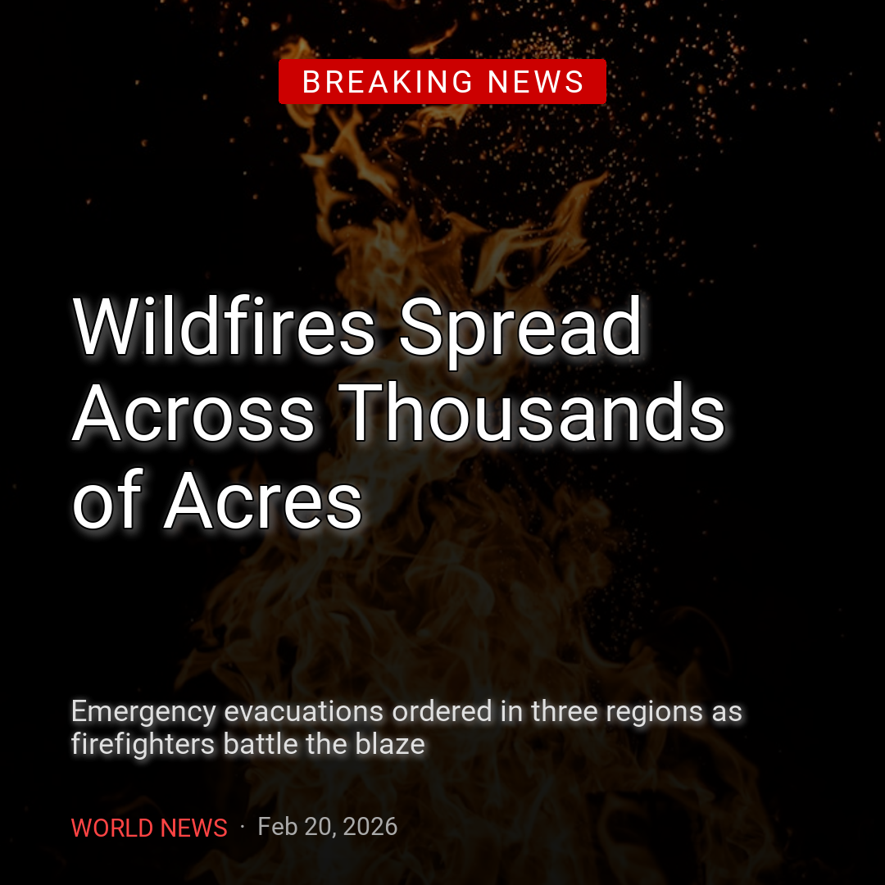
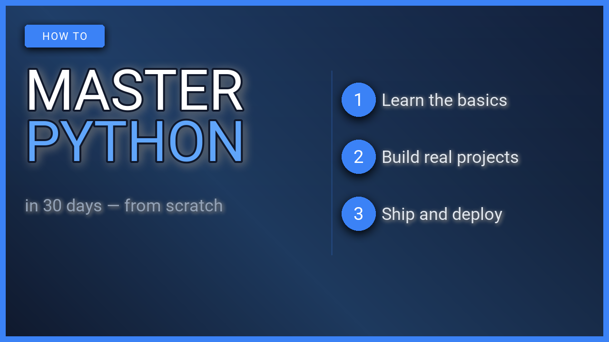
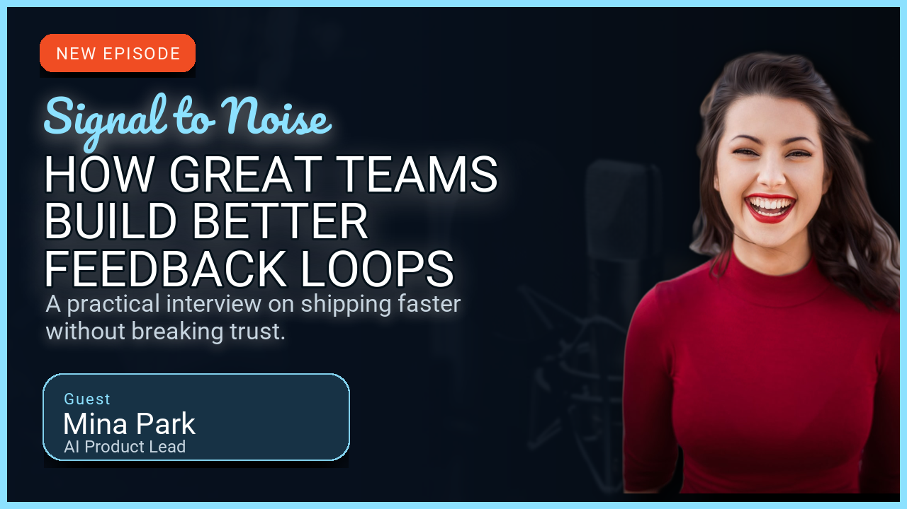

# Cookbook

Ready-to-run examples for common thumbnail and social card formats. Each recipe uses real QuickThumb code you can copy, adapt, and run locally.

## Gallery

| YouTube Thumbnail | Burnout Theme | Instagram News Card |
| :---: | :---: | :---: |
| [](youtube-thumbnail.md) | [](youtube-thumbnail.md) | [](instagram-card.md) |

| Talking Head | Reaction / Commentary | Tutorial / Explainer |
| :---: | :---: | :---: |
| [](youtube-thumbnail.md) | [](youtube-thumbnail.md) | [](youtube-thumbnail.md) |

| Podcast Promo | Shorts / Vertical Cover |  |
| :---: | :---: | :---: |
| [](podcast-promo.md) | [](shorts-cover.md) | |

## Recipes

| Recipe | Format | Highlights |
| --- | --- | --- |
| [YouTube Thumbnails](youtube-thumbnail.md) | 1280×720 | Three layouts: text-only, burnout theme, talking-head split |
| [Instagram Card](instagram-card.md) | 1080×1080 | Breaking news card with gradient overlay and rich text |
| [Podcast Promo](podcast-promo.md) | 1280×720 | Remote images, webfont URL, portrait cutout with `rembg` |
| [Shorts / Vertical Cover](shorts-cover.md) | 1080×1920 | JSON-first workflow driven by an AI-generated spec |
| [AI Workflow](ai-workflow.md) | Any | End-to-end: prompt → JSON → render → iterate |
| [Webfonts & Background Removal](webfonts-rembg.md) | Any | Webfont URLs and `remove_background` walkthrough |

## Prerequisites

All recipes assume QuickThumb is installed:

```bash
pip install quickthumb
```

Some recipes use `remove_background=True` and require the `rembg` extra:

```bash
pip install "quickthumb[rembg]"
```

## Asset paths

The code snippets below use placeholder paths like `"background.jpg"` and `"portrait.png"`. Swap these for your own local files or remote URLs — QuickThumb accepts both.
