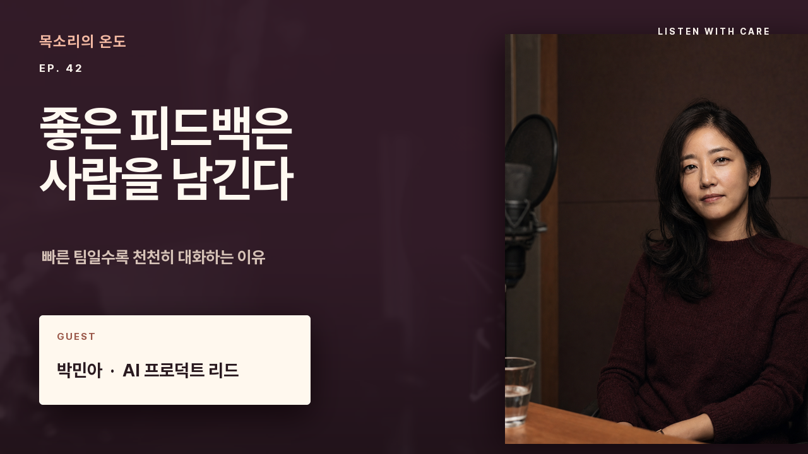

# Podcast Promo



An episode card: show name, episode title, and guest, with the guest's photo
filling the right side.

```bash
git clone https://github.com/sjquant/quickthumb
cd quickthumb
uv run python examples/podcast_interview_promo.py
```

The first run needs network access to download the show-title webfont. After
that it is cached.

## How it's built

- **The portrait is the background.** `.background(image=..., fit=FitMode.COVER)`
  fills the whole canvas with the photo. There is no cut-out, so there are no
  cut-out edges to clean up.
- **A gradient makes room for the text.** A four-stop `LinearGradient` is
  solid black behind the copy and fully clear over the face. Moving the
  middle stops changes where the fade happens.
- **The show title uses a webfont.** `font=SHOW_FONT_URL` points at a `.ttf`
  file on Google Fonts. `weight`, `bold`, and `italic` don't apply to a font
  URL, because the file is already one specific style.
- **One accent color.** The short red rule under the show title is the only
  color on the card; everything else is white or grey.

## Code

```python
--8<-- "examples/podcast_interview_promo.py"
```

To use the same layout with a cut-out portrait instead of a full-bleed photo,
see [Webfonts & background removal](webfonts-rembg.md).
