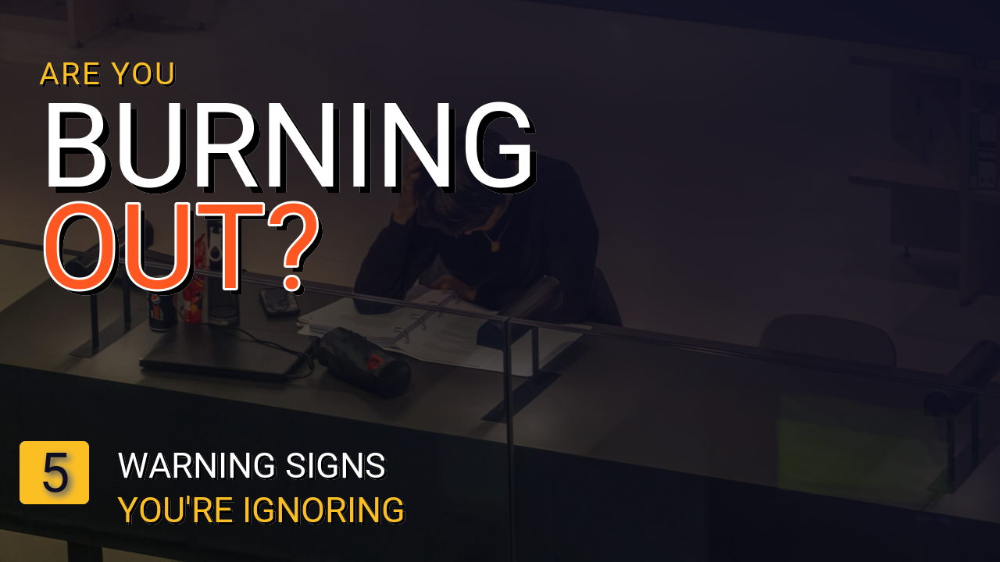
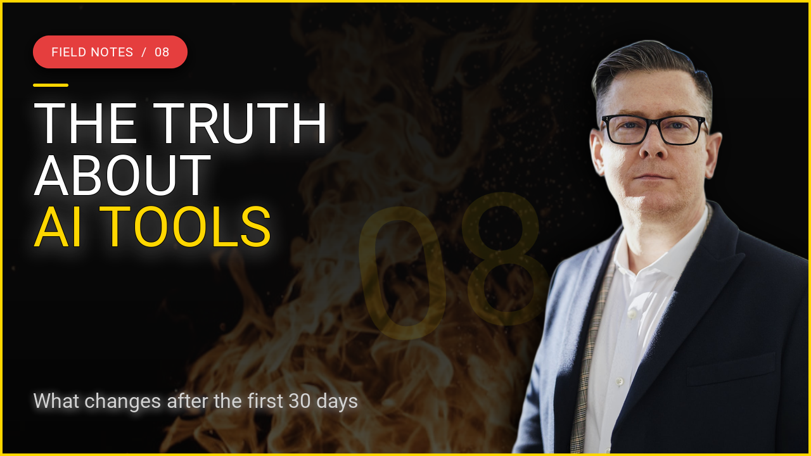
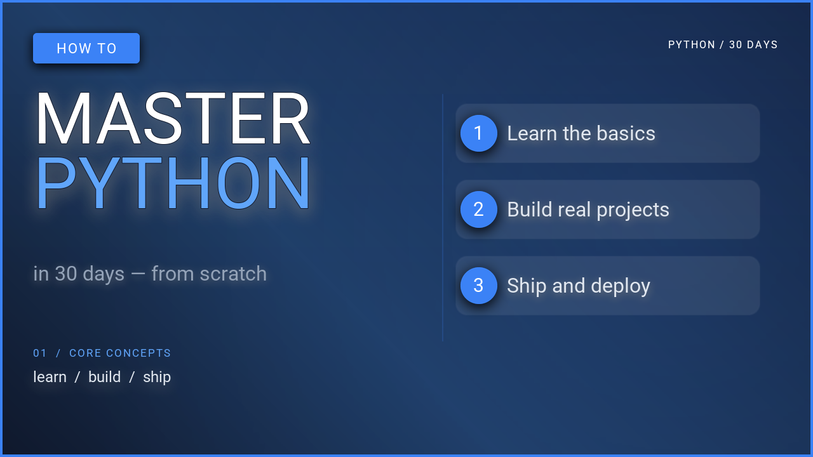

# YouTube Thumbnails

Five 1280×720 layouts. Each image below was rendered by the script under it,
which lives in the repository's `examples/` folder.

To run one, clone the repository and run the script from its root. The scripts
load the bundled fonts and photos from `assets/`.

```bash
git clone https://github.com/sjquant/quickthumb
cd quickthumb
uv run python examples/youtube_thumbnail_01.py
```

## Before / after cards { #before-after }


A photo background, a headline on the left, and two tilted cards on the right
that make the promise concrete.

- A horizontal `LinearGradient` runs from almost-black to clear, so the left
  half is dark enough for text while the photo still shows on the right.
- The three headline lines are one `.text()` layer made of `TextPart`s with
  their own sizes and colors.
- The cards are rotated `rectangle` shapes with a `Stroke`; the front card also
  casts a `Shadow`. The text on each card uses the same `rotation`.

??? example "examples/youtube_thumbnail_01.py"

    ```python
    --8<-- "examples/youtube_thumbnail_01.py"
    ```

## Bold question { #burnout }



A single question set very large, over a photo with most of its color removed.

- `Filter(saturation=0.32)` mutes the photo so the orange accent is the only
  strong color.
- Each headline line is its own text layer at a fixed pixel position, which
  gives exact control over the line gap.
- The thin rule above the hook is a 1px rectangle in `#FFFFFF33`, white at 20%
  opacity.

??? example "examples/youtube_thumbnail_02.py"

    ```python
    --8<-- "examples/youtube_thumbnail_02.py"
    ```

## Talking head { #talking-head }



Headline on the left, presenter on the right.

- The portrait is fetched from a URL and cut out with `remove_background=True`.
  This needs the `rembg` extra (Python 3.11+) and network access:
  `uv run --extra rembg python examples/youtube_talking_head.py`.
- `position=(1280, 720)` with `align=("right", "bottom")` pins the portrait to
  the bottom-right corner whatever its size.
- `max_width="55%"` wraps the headline before it reaches the portrait.

??? example "examples/youtube_talking_head.py"

    ```python
    --8<-- "examples/youtube_talking_head.py"
    ```

## Reaction { #reaction }


A big word, a big number, and a reaction face.

- A `RadialGradient` centered behind the portrait adds a dim red glow. A
  `LinearGradient` on top keeps the text side dark.
- The `#1` behind everything is a 470px text layer at 13% opacity.
- The portrait uses `remove_background=True` (needs the `rembg` extra) and
  `Filter(saturation=0.08)`, which leaves it almost black and white.

??? example "examples/youtube_reaction.py"

    ```python
    --8<-- "examples/youtube_reaction.py"
    ```

## Tutorial { #tutorial }



No photos at all: a headline, a blue panel, and a few lines of "code".

- The code on the panel is one text layer. Each `TextPart` sets its own color
  and weight, which is enough to look like syntax highlighting.
- Colors are module-level constants (`BLUE`, `WHITE`, `GRAY`), so restyling the
  thumbnail means editing three lines.

??? example "examples/youtube_tutorial_explainer.py"

    ```python
    --8<-- "examples/youtube_tutorial_explainer.py"
    ```
