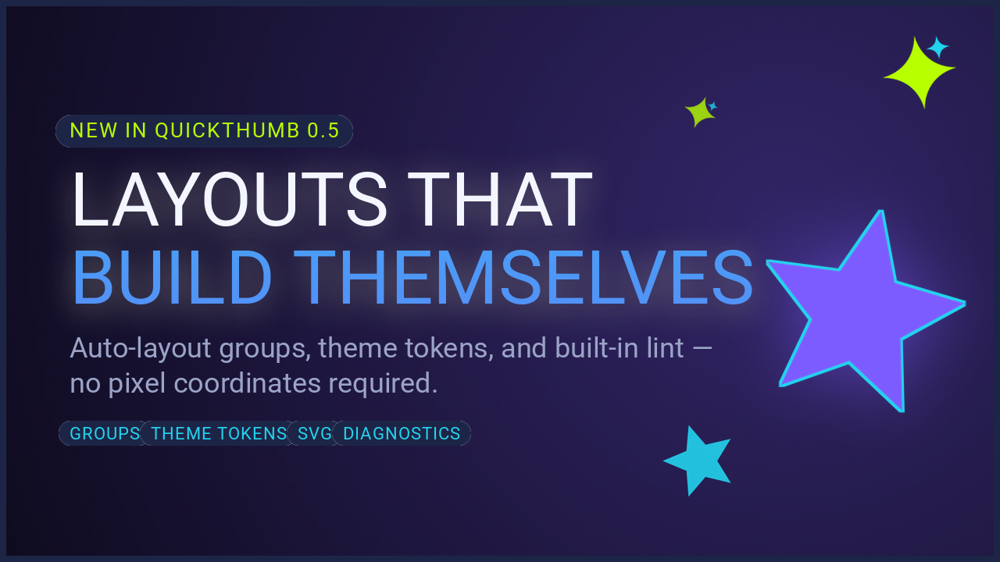

# quickthumb

**Programmatic thumbnail and social image generation** — layered Python and JSON APIs built for speed, AI workflows, and creative control.

## Gallery

| YouTube Thumbnail | Burnout Thumbnail | Instagram News Card |
| --- | --- | --- |
|  |  |  |

| Talking Head | Reaction / Commentary | Tutorial / Explainer |
| --- | --- | --- |
|  |  |  |



*The launch announcement card above is a single JSON spec using `theme` tokens, auto-layout `group` layers, `star` shapes, and `svg` sparkles — see the [cookbook recipe](cookbook/launch-announcement.md).*

## Install

```bash
uv pip install quickthumb
```

## Quick Start

```python
from quickthumb import Canvas, Filter, Stroke, Shadow, TextPart

canvas = (
    Canvas.from_aspect_ratio("16:9", base_width=1280)
    .background(
        image="https://images.unsplash.com/photo-1516321318423-f06f85e504b3",
        effects=[Filter(brightness=0.65)],
    )
    .background(color="#000000", opacity=0.45)
    .text(
        content=[
            TextPart(text="BUILD THUMBNAILS\nFAST\n", color="#B8FF00",
                     effects=[Stroke(width=8, color="#000000")]),
            TextPart(text="With Python or JSON specs", color="#F5F5F5", size=44,
                     effects=[Shadow(offset_x=2, offset_y=2, color="#000000", blur_radius=4)]),
        ],
        size=112,
        position=("8%", "50%"),
        align=("left", "middle"),
        weight=900,
    )
    .outline(width=14, color="#B8FF00")
)

canvas.render("thumbnail.png")
```

## Why quickthumb

- Layer-based composition — backgrounds, text, images, shapes, and SVGs stack in call order
- Works with Python method chaining **and** JSON specs — same result either way
- Remote images, webfonts, gradients, blend modes, and rich text out of the box
- Auto-layout `group` layers and JSON `theme` tokens — specs survive copy changes and rebrands
- Built-in diagnostics (`canvas.diagnose()` / `quickthumb lint`) catch off-canvas layers, tiny text, and low contrast before you ship
- Good fit for AI-assisted workflows that need deterministic, validatable image specs

[Get started](getting-started.md){ .md-button .md-button--primary }
[API Reference](api/index.md){ .md-button }


## Community & Support

- Bug report or feature request: [GitHub Issues](https://github.com/sjquant/quickthumb/issues)
- Questions and ideas: [GitHub Discussions](https://github.com/sjquant/quickthumb/discussions)
