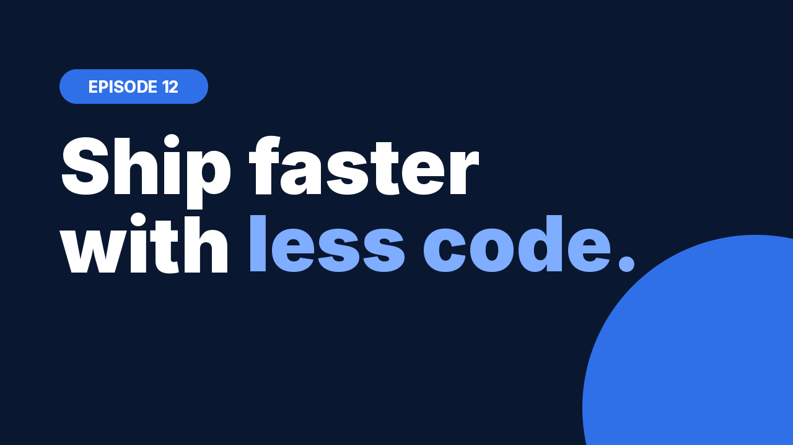

<section class="qt-hero" markdown>

# Thumbnails, from code.

quickthumb is a Python library that renders thumbnails and social images from
layers you describe in code or JSON. Same input, same pixels — every time.

```bash
pip install quickthumb
```

[Get started](getting-started.md){ .md-button .md-button--primary }
[See examples](cookbook/index.md){ .md-button }

</section>

<section class="qt-block" markdown>

## This code makes this image.

=== "Python"

    ```python
    from quickthumb import Canvas, TextPart

    canvas = (
        Canvas(1280, 720)
        .background(color="#0A1730")
        .shape("ellipse", position=(940, 380), width=560, height=560, color="#2F6FE8")
        .shape("pill", position=(96, 112), width=240, height=56, color="#2F6FE8")
        .text("EPISODE 12", font="Inter", font_source="google", size=26, weight=800,
              color="#FFFFFF", position=(216, 140), align=("center", "middle"))
        .text(
            [TextPart(text="Ship faster\nwith "),
             TextPart(text="less code.", color="#7FADFF")],
            font="Inter", font_source="google", size=124, weight=900,
            color="#FFFFFF", position=(96, 220), line_height=1.0,
        )
    )

    canvas.render("thumbnail.png")
    ```

=== "JSON"

    ```json
    {
      "kind": "canvas",
      "width": 1280,
      "height": 720,
      "layers": [
        {"type": "background", "color": "#0A1730"},
        {"type": "shape", "shape": "ellipse", "position": [940, 380],
         "width": 560, "height": 560, "color": "#2F6FE8"},
        {"type": "shape", "shape": "pill", "position": [96, 112],
         "width": 240, "height": 56, "color": "#2F6FE8"},
        {"type": "text", "content": "EPISODE 12",
         "font": "Inter", "font_source": "google", "size": 26, "weight": 800,
         "color": "#FFFFFF", "position": [216, 140], "align": ["center", "middle"]},
        {"type": "text",
         "content": [{"text": "Ship faster\nwith "},
                     {"text": "less code.", "color": "#7FADFF"}],
         "font": "Inter", "font_source": "google", "size": 124, "weight": 900,
         "color": "#FFFFFF", "position": [96, 220], "line_height": 1.0}
      ]
    }
    ```

<figure class="qt-output" markdown>

<figcaption>thumbnail.png · 1280 × 720</figcaption>
</figure>

Layers are drawn in the order you add them. The JSON spec renders the exact same
pixels, so a template engine or an LLM can write the layout instead of you.

</section>

<section class="qt-block" markdown>

## Made with quickthumb.

Every image here is a runnable recipe in the cookbook.

<div class="qt-gallery" markdown>
[](cookbook/youtube-thumbnail.md)
[](cookbook/youtube-thumbnail.md)
[](cookbook/podcast-promo.md)
[](cookbook/launch-announcement.md)
</div>

[Browse all recipes →](cookbook/index.md){ .qt-more }

</section>

<section class="qt-block" markdown>

## Also included.

<dl class="qt-list" markdown>
<div markdown>
<dt markdown="span">[Export to any format](exports.md)</dt>
<dd markdown="span">PNG, JPEG, WebP, SVG, PDF, PPTX, GIF, and MP4 from the same canvas.</dd>
</div>
<div markdown>
<dt markdown="span">[Check before you ship](diagnostics.md)</dt>
<dd markdown="span"><code>diagnose()</code> flags off-canvas layers, unreadable text, and low contrast.</dd>
</div>
<div markdown>
<dt markdown="span">[Layout without coordinates](api/group.md)</dt>
<dd markdown="span">Groups stack layers in rows and columns, so long titles don’t break the design.</dd>
</div>
<div markdown>
<dt markdown="span">[Multi-slide decks](api/deck.md)</dt>
<dd markdown="span">Turn several canvases into a slideshow, PDF, PPTX, or narrated video.</dd>
</div>
<div markdown>
<dt markdown="span">[A schema for AI agents](json-schema.md)</dt>
<dd markdown="span">Hand an LLM the JSON Schema and let it generate valid specs.</dd>
</div>
</dl>

</section>

<section class="qt-block qt-end" markdown>

## Your first thumbnail takes five minutes.

```bash
pip install quickthumb
```

[Get started](getting-started.md){ .md-button .md-button--primary }
[API reference](api/index.md){ .md-button }

</section>
